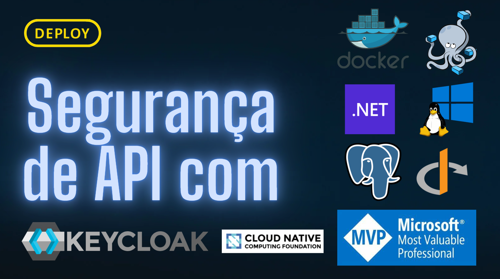

# Segurança de API com KeyCloak



> [!NOTE]
> Docker
>
> Docker compose
>
> .NET 9 SDK

## Passo a passo

- Criação do Realm

- Menu: Client

  Criar o Client \* Deixar o "Client Authentication" Marcado

- Menu: Client scopes

  Criar um novo scope \* Deixar o "Include in token scope" marcado

  - Mappers - Configure new mapper
  - Selecionar o "Audience" e depois coloque um nome

- Voltar na tela do "Clients" depois clicar na aba "Client scopes" e depois no botão "Add client scope"

- Menu User

  Criar um novo User

  Clicar no user criado, aba Credentials, criar uma senha. Não deixar marcado a aba Temporary

```curl
curl --location --request POST 'http://localhost:8080/realms/<REALM_NAME>/protocol/openid-connect/token' --header 'Content-Type: application/x-www-form-urlencoded' --data-urlencode 'grant_type=password' --data-urlencode 'client_id=' --data-urlencode 'client_secret=' --data-urlencode 'username=' --data-urlencode 'password='
```

```curl
curl --location --request POST 'http://localhost:8080/realms/CanalDEPLOY/protocol/openid-connect/token' --header 'Content-Type: application/x-www-form-urlencoded' --data-urlencode 'grant_type=password' --data-urlencode 'client_id=client-api' --data-urlencode 'client_secret=f1iW2gAjZJs7aIYZdexebxwzUHO1NbDZ' --data-urlencode 'username=user-api' --data-urlencode 'password=abcd123'
```

```javascript
var jsonData = JSON.parse(responseBody);
postman.setEnvironmentVariable('token', jsonData.access_token);
```

# Docs

- [Dotnet Ports](https://learn.microsoft.com/en-us/dotnet/core/compatibility/containers/8.0/aspnet-port)

- https://www.keycloak.org/server/all-config

- https://www.pgadmin.org/docs/pgadmin4/development/container_deployment.html